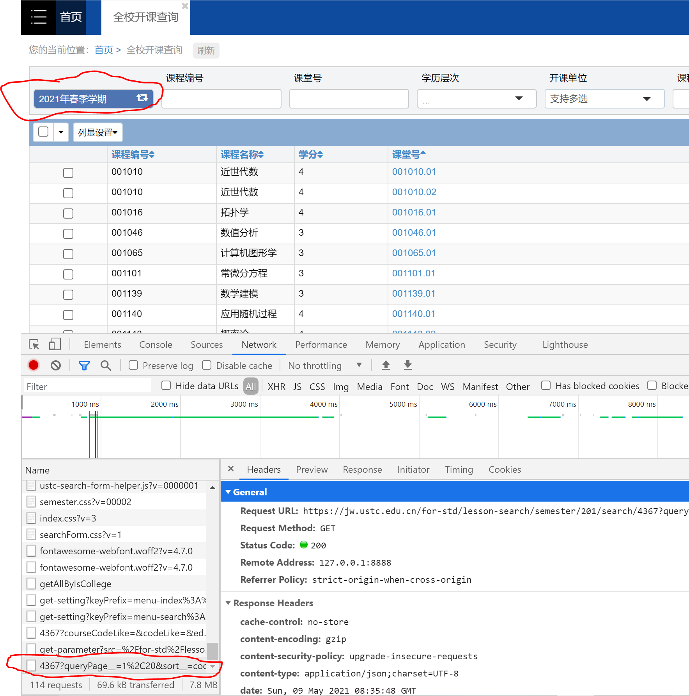
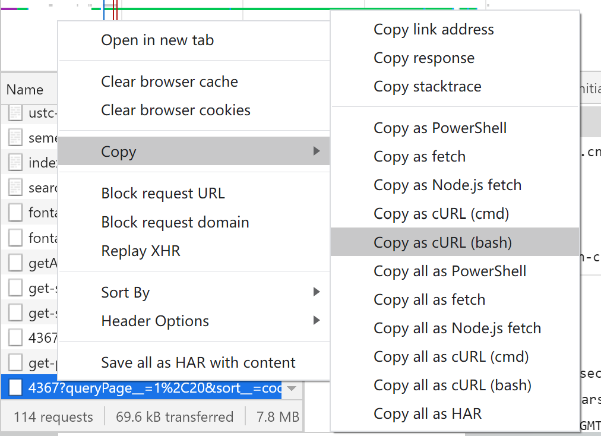
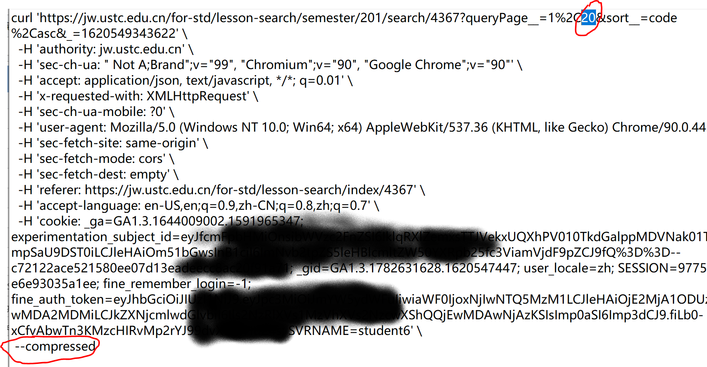

# How to import courses

本来打算写一个脚本搞定从登录到获取课程信息JSON，但发现这个过程有点复杂（特别是选择学期这块），就用文档方式写下来，手动操作。

1. 使用Chrome浏览器
2. 用统一身份认证账号密码（本科学号/密码）登录综合教务系统 https://jw.ustc.edu.cn/
3. 打开浏览器Developer Tools（F12）中的Network选项卡
4. 点击综合教务系统网页中的“全校开课查询”，如图所示


5. 在左上角点击想要的学期，例如“2021年春季学期”（如果一开始就是想要的学期，那么先点一个别的学期，再点想要的这个学期），然后从Developer Tools中找到最后一个发出的HTTP请求。



6. 右键点击这个HTTP请求，Copy as curl (bash)。



7. Ctrl+V 粘贴到一个文本文件中，然后把curl命令第一行中的“20”改成“100000”（每次请求显示课程的条数，100000就是显示全部了）；把最后一行中的 "--compressed" 去掉（这样教务系统返回的就不是压缩后的数据，不然还要解压）。



8. 将修改后的文本文件内容（curl命令）粘贴到服务器的Linux终端上，命令结果输出到一个 json 文件：```curl ... >courses-20202.json```

```
$ curl 'https://jw.ustc.edu.cn/for-std/...
>   -H 'authority: jw.ustc.edu.cn' \
>   -H 'sec-ch-ua: " Not A;Brand";v="99", "Chromium";v="90", "Google Chrome";v="90"' \
......
>   -H 'cookie: ......
> > courses-20202.json
  % Total    % Received % Xferd  Average Speed   Time    Time     Time  Current
                                 Dload  Upload   Total   Spent    Left  Speed
100 14.1M    0 14.1M    0     0   487k      0 --:--:--  0:00:29 --:--:-- 3950k
```

9. 运行导入课程的脚本，参数是刚才curl下载下来的 JSON 文件。

```
$ ./import_courses_new.py ../data/courses-20202.json
110 existing departments loaded
3537 existing teachers loaded
12392 existing courses loaded
50458 existing course classes loaded
39286 existing course terms loaded
Data loaded with 2042 courses
Existing course 近世代数(欧阳毅)
Existing course term 近世代数(欧阳毅)@20202
Existing course class 00101001@20202
......
load complete, committing changes to database
15 new teachers loaded
95 new courses loaded
128 new terms loaded
65 new classes loaded
```

脚本运行完成后，课程导入过程就结束了。
